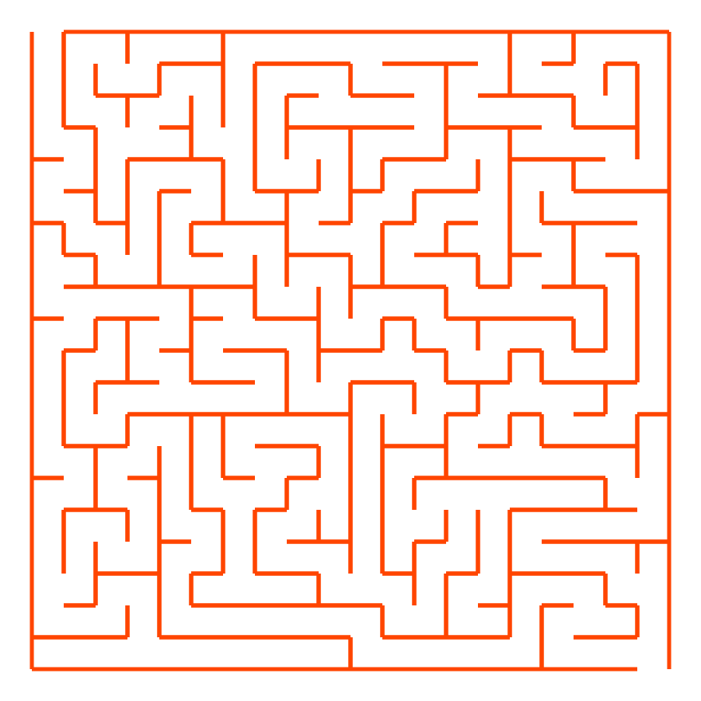
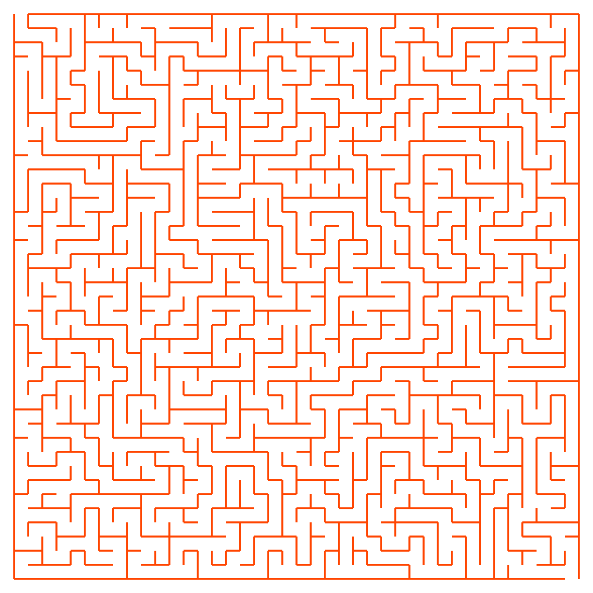

# Maze Generator

> example in action can be seen here: https://malteklaes.de/randomMazeGenerator

This is a simple beginner's project, back then as a preliminary course at the Vienna University of Technology and actually developed in Processing (.pde). In order to be able to use it directly in the browser, the project (in the sense of the P5js project (https://p5js.org/)) is also translated into Javascript and can be used directly.

To increase the difficulty you have to adjust the variable n, the smaller the easier, for example n=20 

or more difficult, for example n=40.

# Maze Generator with PathFinder

Additional there is also a javascript for a maze generator with an BFS-like naive pathfinder algorithm, which also solves a random generated maze (with an animation for a little gamification)

